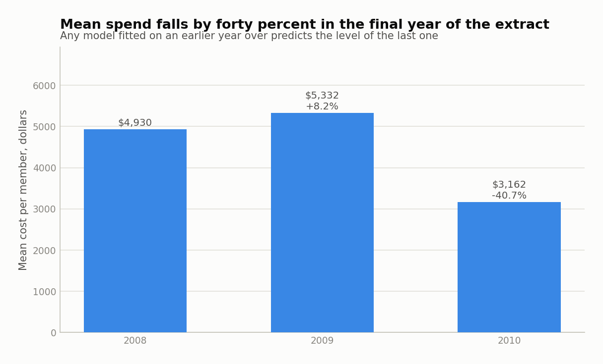
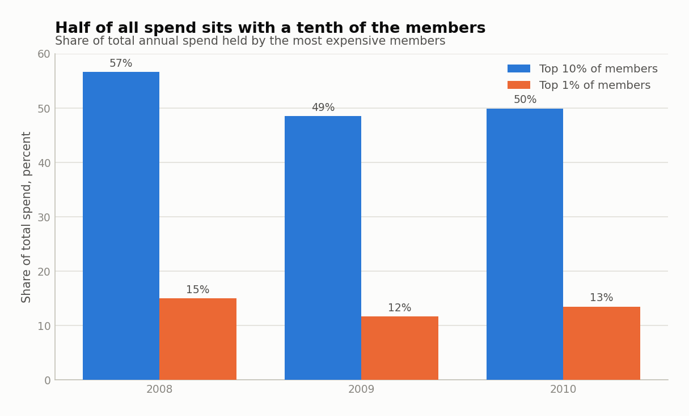
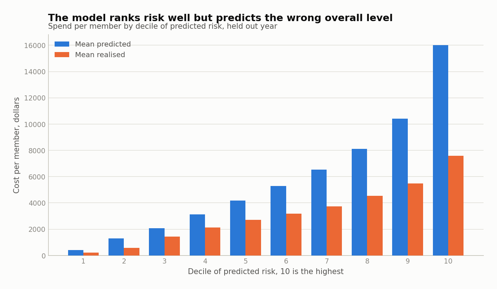
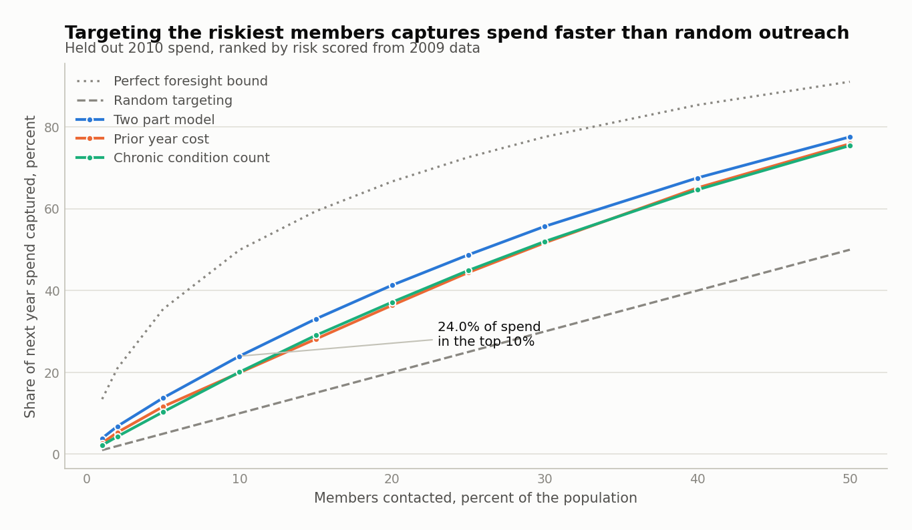
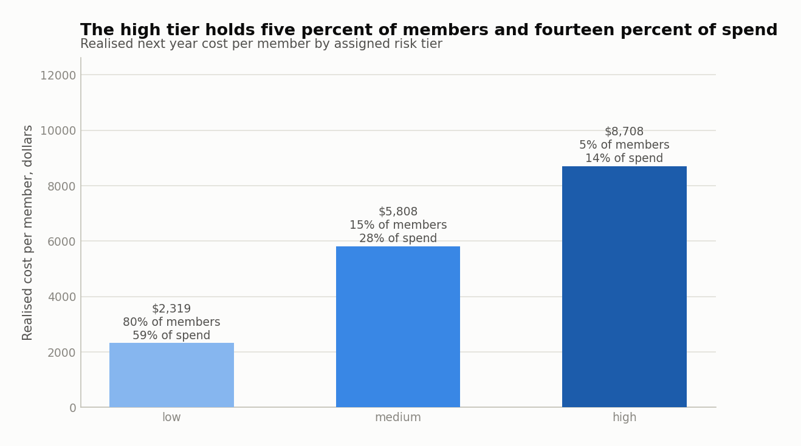
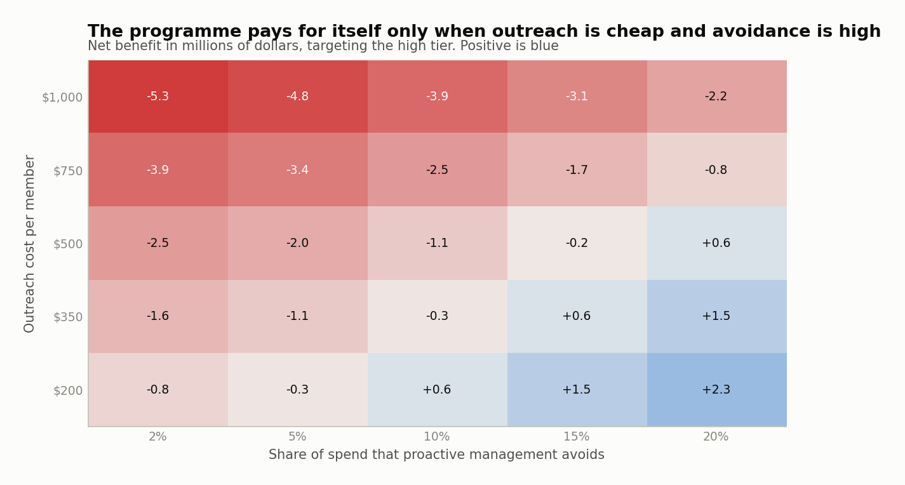
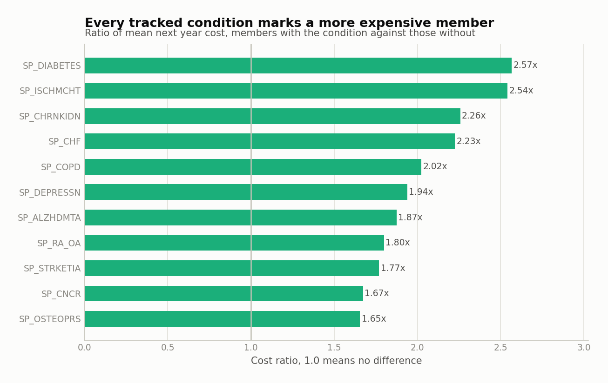
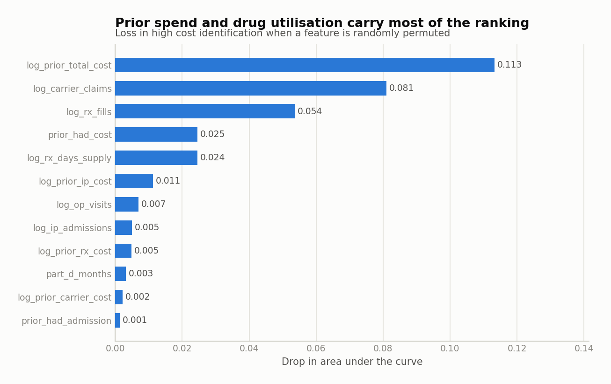

# Healthcare cost prediction and high cost claimant risk stratification

I built a member level cost prediction model on CMS Medicare claims data and used it to
stratify members into risk tiers for care management targeting. The model is a two part
cost model, the standard health economics treatment for spending data, and it is
evaluated prospectively: features from one year, realised cost from the next.

The operational result is that ranking members by predicted risk and contacting the top
10 percent reaches 23.97 percent of next year spending, against 10 percent for random
outreach and 19.92 percent for the obvious alternative of ranking members by what they
cost last year.

The honest result, which I put next to it rather than at the bottom, is that the eleven
recorded chronic conditions contribute nothing to that ranking once prior utilisation is
in the model, and that the programme this model would support does not pay for itself
under my assumed intervention economics. Both findings are measured below.

## Contents

- [Headline numbers](#headline-numbers)
- [The data](#the-data)
- [What I checked before modelling anything](#what-i-checked-before-modelling-anything)
- [Why a two part model](#why-a-two-part-model)
- [The prospective design](#the-prospective-design)
- [Model performance](#model-performance)
- [Finding the high cost members](#finding-the-high-cost-members)
- [Risk tiers and the care management business case](#risk-tiers-and-the-care-management-business-case)
- [What actually drives the score](#what-actually-drives-the-score)
- [Limitations](#limitations)
- [Running it](#running-it)
- [Repository layout](#repository-layout)

## Headline numbers

Every figure below comes from a single clean run of the pipeline against the real CMS
extract. Nothing is estimated or carried over from memory.

| Result | Value |
|---|---|
| Members in the held out evaluation year | 112,845 |
| Probability of any spend, area under the curve | 0.9681 |
| High cost identification, area under the curve | 0.7644 |
| Rank correlation with realised cost | 0.7167 |
| Share of next year spend reached in the top 10 percent | 23.97% |
| The same for random outreach | 10.00% |
| The same for ranking on last year's cost | 19.92% |
| The same under perfect foresight | 49.93% |
| High tier size, and its share of spend | 5.0% of members, 13.77% of spend |
| Avoidable spend needed to break even on outreach | 16.41% |

## The data

CMS **DE-SynPUF**, the 2008 to 2010 Data Entrepreneurs' Synthetic Public Use File. It is
published by CMS, free, and requires no data use agreement. It is fully synthetic, built
so that no record corresponds to a real beneficiary, but it carries the real file and
column structure of Medicare claims.

I used **subsample 2**, one of the twenty official tranches, at roughly 116,000
beneficiaries. I did not use the full population, and I did not use subsample 1, for a
specific reason: the CMS page for subsample 1 links to the subsample **20** file for the
2010 beneficiary summary, and no 2010 summary file for subsample 1 is published at the
canonical path. Without a 2010 enrolment file there is no 2009 to 2010 prospective split,
so subsample 1 cannot support this design. Subsample 2 is complete and every tranche is
an equivalent random draw.

Five file types, all five used:

| File | Records | What I take from it |
|---|---|---|
| Beneficiary summary, 2008 | 116,395 | Enrolment, demographics, chronic conditions |
| Beneficiary summary, 2009 | 114,618 | The same, and the training target year |
| Beneficiary summary, 2010 | 112,845 | The same, and the evaluation target year |
| Inpatient claims | 66,494 | Admission cost, admission count, length of stay |
| Outpatient claims | 792,562 | Visit cost, visit count, emergency visits |
| Carrier claims | 4,745,914 | Professional cost, claim count |
| Prescription drug events | 5,561,154 | Drug cost, fill count, days supply |

The beneficiary summary file is the enrolment denominator, not the claims files. Building
the cohort from claims would silently drop every member who used no services, and those
members are exactly the negative class the first part of the model has to learn.

Cost is defined as the amount borne by the payer. For the institutional and professional
files that is the claim payment amount. For drugs it is the total drug cost less the
patient payment, because DE-SynPUF carries no third party payment field.

## What I checked before modelling anything

CMS states in the user guide that the relationships between variables in this file were
deliberately altered to limit re-identification risk, and that multivariate results
should be treated with caution. That is a claim about the data that can be measured
rather than repeated, so I measured it.

**The extract is intact.** All seven record counts match the counts CMS publishes for
subsample 2, exactly. Chronic condition prevalence in 2008 matches the published figures
to within 0.25 percentage points on every condition tested. Cost rebuilt from the claim
files reconciles against the annual totals carried on the summary file at a correlation
of 0.9984 or better in all three years, with the aggregate within 1.9 percent.

**Year over year signal survived, and it decays.** Prior spend does predict later spend,
but the relationship weakens across the panel.

| Year pair | Rank correlation | High cost persistence | Against a 10% baseline |
|---|---|---|---|
| 2008 to 2009 | 0.7807 | 34.00% | 3.40x |
| 2009 to 2010 | 0.6714 | 23.11% | 2.31x |

**The third year breaks.** Mean spend per member falls 40.7 percent between 2009 and
2010, from $5,331.93 to $3,162.04. CMS attributes the lower 2010 volume to death
attrition and disclosure treatment. This matters more than it first appears: any model
fitted on 2009 spending levels will systematically over predict 2010, and it does, by a
factor of 1.82. I keep the two effects separate throughout, because a level error and a
ranking error have completely different operational consequences.



**Spend is heavily concentrated,** which is what makes targeting worth doing at all. In
2010 the most expensive 10 percent of members account for 49.93 percent of all spending
and the top 1 percent account for 13.47 percent.



**Two planned features turned out to be duplicates.** The original scope called for a distinct
provider count and a distinct drug count. I built both, then found that the distinct drug
product count equals the fill count for 99.6 percent of members, and the distinct
performing physician count tracks the carrier claim count at a correlation of 0.9989.
Provider and product identifiers were randomised when the file was synthesised, so a
distinct count of them re-measures claim volume rather than breadth of care. Keeping both
members of such a pair leaves the coefficients unidentifiable, so the pipeline drops the
second of each pair and records the decision in
`reports/tables/dropped_collinear_features.csv`.

Emergency visits are identified from evaluation and management codes 99281 to 99285,
because DE-SynPUF outpatient records carry no revenue centre code. The proxy fires on
62,896 visits covering 14.6 percent of member years, so it is populated rather than
vestigial, but it is a proxy and I treat it as one.

## Why a two part model

Healthcare spending is a mixture of two different things. Between 11 and 14 percent of
members in a given year cost nothing at all, and among the rest the distribution has a
skew above 4.3 in every year. A single regression has to satisfy the point mass at zero
and the long right tail at the same time, and it fits neither well.

So the model is split:

1. **Participation.** A logistic model for the probability of any spend next year.
2. **Severity.** A Gamma generalised linear model with a log link for the level of spend,
   fitted only on members who actually spent.

Expected cost is the product of the two.

I used a Gamma family with a log link rather than ordinary least squares on logged cost
deliberately. A log OLS fit predicts the mean of the log, and converting that back to
dollars needs a smearing correction that is only valid when the error variance is
constant. The Gamma model predicts the mean in dollars directly and lets the variance
grow with the mean, which is what claims data does.

A single stage gradient boosted model with a Poisson loss is fitted alongside as a
challenger, so the two part structure has to earn its place rather than be asserted.

## The prospective design

This is the part that decides whether a risk score is actually useful, so it is strict.

- **Train:** 2008 features against realised 2009 cost. 114,618 members.
- **Evaluate:** 2009 features against realised 2010 cost. 112,845 members.

The evaluation year pair is never seen during fitting, by either part of the model, by
the scaler, or by the collinearity pruning. Every feature is drawn from the feature year
only, so nothing that would be unknown at scoring time can leak in. A test asserts that
the target column and every column derived from it stay out of the design matrix.

Members who die during the target year are kept. End of life spending is a real and large
part of what a care management team has to plan for, and dropping those members would
flatter the model.

## Model performance

| Metric | Held out 2009 to 2010 |
|---|---|
| Participation, area under the curve | 0.9681 |
| Severity, rank correlation on spenders | 0.6177 |
| Combined, rank correlation | 0.7167 |
| Combined, mean absolute error | $4,124.59 |
| Predictive ratio, predicted over actual | 1.8159 |
| Coefficient of determination, as fitted | -0.2384 |
| Coefficient of determination, after a level correction | 0.1506 |

The two coefficients of determination need explaining, because the first one looks like a
failure and is not quite that.

The model ranks members well and predicts the wrong overall level. It was fitted on a
year whose mean spend was $5,331.93 and applied to a year whose mean spend was
$3,162.04, so it over predicts by 1.82x, and a raw coefficient of determination punishes
that heavily. Rescaling every prediction by one constant, the way a plan applies a budget
trend factor, moves it from -0.2384 to 0.1506 and changes the ranking not at all. That
second number uses the target year mean, so it is a diagnostic decomposition rather than
a prospective claim, and I label it that way in the output.

The calibration table makes the same point more clearly. Mean realised cost rises
monotonically across all ten deciles of predicted risk, from $216.93 to $7,580.72, a
35 fold spread. The ordering is right in every decile. The level is high in every decile.



For targeting, the ordering is the part that matters, and rank based measures are immune
to the level shift entirely.

## Finding the high cost members

High cost is defined as the top decile of realised 2010 spend, which is 11,300 members
above a threshold of $7,050.

The question that matters operationally is not the coefficient of determination, it is
how much of next year's spending sits inside the group you decide to contact.



| Ranking used | Spend reached in top 10% | High cost members found | Lift |
|---|---|---|---|
| Two part model | 23.97% | 30.54% | 2.40x |
| Gradient boosted challenger | 23.70% | 30.22% | 2.37x |
| Chronic condition count | 20.07% | 23.96% | 2.01x |
| Last year's cost | 19.92% | 23.11% | 1.99x |
| Random | 10.00% | 10.00% | 1.00x |
| Perfect foresight | 49.93% | 100% | 4.99x |

Two things are worth saying plainly about this table.

The model beats the naive alternatives, by about 4 percentage points of captured spend
over ranking on last year's cost. That is a real improvement and it is the reason to
build a model rather than sort a spreadsheet.

It is also a long way from perfect foresight, and it should be. Of the gap between random
targeting and the oracle, the model closes about 35 percent. Next year's catastrophic
cases are dominated by events that have not happened yet, and no amount of feature
engineering on last year's claims will find them. A model that appeared to close that gap
would be leaking.

The gradient boosted challenger is a statistical tie with the two part model, slightly
ahead on area under the curve and slightly behind on captured spend. I kept the two part
model as primary because it is interpretable, gives calibrated components a stakeholder
can reason about separately, and costs nothing in performance here.

## Risk tiers and the care management business case

A continuous risk score is not something a care management team can act on, so it is cut
into three operational tiers at the 80th and 95th percentiles of predicted risk.



| Tier | Members | Share of members | Realised cost per member | Share of spend | Concentration |
|---|---|---|---|---|---|
| Low | 90,276 | 80.0% | $2,319.21 | 58.68% | 0.73x |
| Medium | 16,926 | 15.0% | $5,808.42 | 27.55% | 1.84x |
| High | 5,643 | 5.0% | $8,707.89 | 13.77% | 2.75x |

**The economic assumptions are assumptions.** The claims data says nothing about what an
outreach programme costs or how much spending it prevents. I state them here rather than
letting them hide in the code:

| Input | Assumed value | Basis |
|---|---|---|
| Outreach cost per targeted member | $500 | Assumed |
| Share of spend proactive management avoids | 10% | Assumed |
| Share of targeted members who engage | 35% | Assumed |

On those assumptions, targeting the high tier reaches $49.1 million of realised spend
against $17.8 million for a randomly chosen group of the same size, so it avoids
$1,719,852 against $624,519, an advantage of $1,095,333.

And it still loses money. Outreach to 5,643 members costs $2,821,500, so the net result
is **negative $1,101,648**, a return of 61 cents per dollar spent. Random targeting
returns 22 cents.

The decision relevant output is therefore not the return, which is an artefact of three
assumed numbers, but the **break even point: proactive management must avoid 16.41
percent of the high tier's spending for the programme to pay for itself**, against the 10
percent I assumed. That is a claim a care management leader can argue with using their
own programme data, which is the point.



The sensitivity grid shows where the programme turns positive. At $200 per member it
works from a 10 percent avoidable share. At $1,000 per member it does not work anywhere
in the range tested.

## What actually drives the score

This is where I would push back on my own project if I were interviewing me.

Taken one at a time, every chronic condition looks strongly predictive. Members with
diabetes cost 2.57 times what members without it cost, and the weakest condition tested,
osteoporosis, still marks a 1.65 times difference.



Taken together with prior utilisation, they add nothing at all.

| Feature block | Features | High cost AUC | Spend reached in top 10% |
|---|---|---|---|
| Demographics, coverage and the 11 conditions | 18 | 0.7370 | 21.34% |
| Prior cost and utilisation only | 15 | 0.7646 | 23.91% |
| Everything | 33 | 0.7644 | 23.97% |

Refitting on prior utilisation alone gives an area under the curve of 0.7646. Adding all
eighteen clinical and demographic features moves it to 0.7644, which is nothing, and very
slightly the wrong way. Permutation importance agrees from the other direction: prior
total cost is worth 0.113 of area under the curve, carrier claim volume 0.081, drug fills
0.054, and every one of the eleven condition flags is worth 0.0003 or less. Age is worth
nothing measurable.



I do not think this generalises to real Medicare data, and I would not present it as if it
did. In real claims, diagnosed comorbidity carries independent predictive weight beyond
utilisation, which is the entire premise of CMS-HCC risk adjustment. The likeliest
explanation is the one CMS documents: the associations between variables in this file
were deliberately altered, and the condition flags were synthesised by a different
process from the claims. What the result does establish is that the pipeline is honest
enough to report a null when it finds one, and the ablation is the right instrument for
asking the question on real data.

## Limitations

Stated up front, in the order I would expect to be challenged on them.

**The data is synthetic, and CMS says its multivariate structure is altered.** This is
not a caveat about realism at the margin. It is the reason the chronic conditions carry
no incremental signal above, and it means no coefficient here should be read as a claim
about medicine. What transfers is the pipeline, the design, and the evaluation, all of
which would run unchanged on a real limited data set.

**This is not CMS-HCC.** It is a simplified condition and utilisation based risk score.
The official model is calibrated on real claims and maps ICD diagnoses to hierarchical
condition categories, and this extract predates the ICD-10 transition. I use the
documented CCW condition flags directly rather than deriving my own, and the result is
inspired by the same idea, not a replica of it.

**The intervention economics are invented.** The $500 outreach cost, the 10 percent
avoidable share and the 35 percent engagement rate are not in the claims data and are not
derived from published programme evaluations. Every dollar figure in the business case
inherits them. The break even fraction and the sensitivity grid are the parts that
survive changing them.

**The evaluation is a single year pair.** With three years of data there is exactly one
honest prospective split. There is no confidence interval around the 4 percentage point
advantage over ranking on prior cost, and I would not claim one. Repeating across the
other nineteen subsamples would give a distribution for that gap, and it is the first
thing I would add.

**The target year is not like the others.** Mean spend drops 40.7 percent in 2010 and the
model over predicts by 1.82x as a result. Ranking is unaffected, and every targeting
number above is rank based, but any absolute dollar prediction from this model needs a
trend adjustment that the data cannot supply prospectively.

**Emergency visits are a proxy.** DE-SynPUF outpatient records carry no revenue centre
code, so emergency visits are inferred from evaluation and management codes 99281 to
99285. This will miss emergency encounters coded differently.

**Members are attributed to a year by claim through date.** Claims spanning a year end
land in the later year. This is the CMS convention and contributes to the roughly 1.5
percent gap between claim derived cost and the summary file totals.

## Running it

Requires Python 3.10 or later.

```bash
pip install -r requirements.txt
```

Download and unpack the CMS extract, 362 MB compressed and 2.9 GB unpacked:

```bash
make data
```

Run everything:

```bash
make all
```

Or one phase at a time:

```bash
make phase1
```

Run the tests, which use in memory fixtures and need no downloaded data:

```bash
make test
```

The full pipeline takes about six minutes on a laptop, most of it in the carrier claims
aggregation, which streams 4.7 million line structured records in chunks.

## Repository layout

```
config/config.yaml        every threshold, cost assumption and year pair
scripts/download_data.sh  CMS download and unpack
src/claims.py             the four claim sources aggregated to member-year
src/cohort.py             enrolment panel, demographics, condition flags
src/features.py           feature construction and collinearity pruning
src/model.py              the two part model and the challenger
src/evaluate.py           metrics, concentration and capture curves
src/tiering.py            risk tiers and the business case
src/explain.py            permutation importance and the ablation
src/audit.py              data quality and signal detectors
src/figures.py            every figure, drawn from the published tables
tests/                    40 tests
reports/tables/           every number quoted above, as CSV
reports/figures/          every figure
reports/case_write_up.md  the business framing
```

The raw CMS files are not committed. They are excluded in `.gitignore` and rebuilt with
`make data`.

## Licence

MIT. See [LICENSE](LICENSE).

The DE-SynPUF data is published by the Centers for Medicare and Medicaid Services and is
in the public domain.
